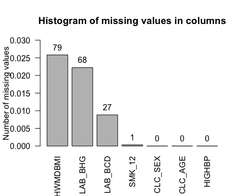
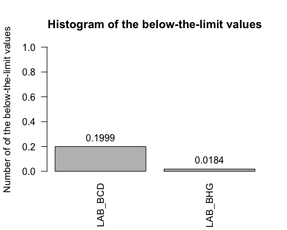
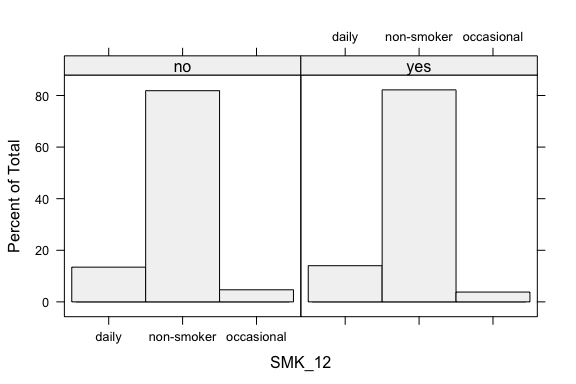
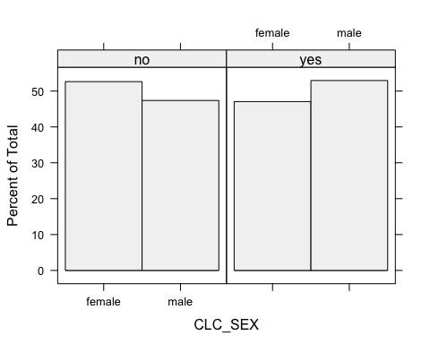
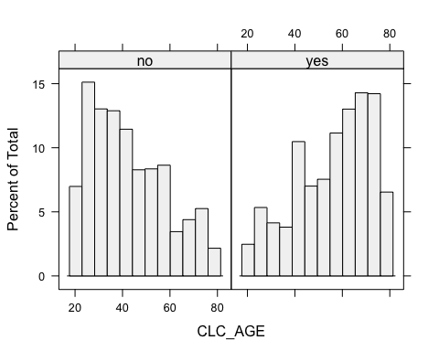
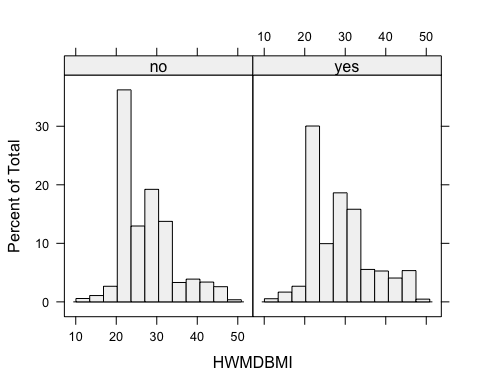
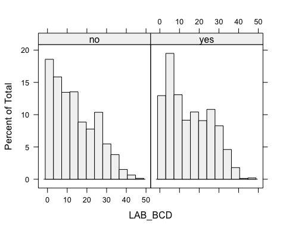
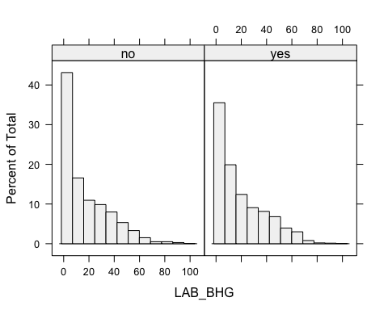

Report on the Case Study 1
================
Aleksandr Tsybakin

``` r
# Import packages
library(mi)
library(missForest)
library(VIM)
library(survey)
library(lattice)
lattice.options(default.theme = standard.theme(color = FALSE))
```

# Introduction

This research examines the [Case Study 1 “Does survey design information
matter?”](https://ssc.ca/en/case-study/case-study-1-does-survey-design-information-matter)
provided by the *Statistical Society of Canada*. The main aim of this
study is to specify the risk factors associated with the hypertension
for Canadian population and determine the impact of introducing the
survey information into models. The data represents both the physical
and medical indicators of individuals.

``` r
# Upload the data
df = read.csv("./chms_2018.csv")
head(df[1:8], 5)
```

    ##   CLINICID SMK_12 CLC_SEX CLC_AGE HWMDBMI HIGHBP LAB_BCD LAB_BHG
    ## 1 39990007      3       2      57   26.77      2     4.3   999.5
    ## 2 39990008      3       1      57   32.21      2      NA    27.0
    ## 3 39990009      3       2      69      NA      2    31.0    77.2
    ## 4 39990011      3       2      67   44.06      1     6.7    21.2
    ## 5 39990012      3       1      36   31.69      2     6.9    20.5

``` r
sprintf("Number of rows: %d", nrow(df))
```

    ## [1] "Number of rows: 3060"

``` r
sprintf("Number of columns: %d", ncol(df))
```

    ## [1] "Number of columns: 509"

The provided dataset contains 509 aspects of 3050 individuals: a unique
identifier, 7 aspects that could be associated with hypertension, and
501 weight values. The weight values consist of 1 *Survey weight* and
500 *Bootstrap weights*. The Survey weight contains information about
the represented Canadian population, while the Bootstrap weights are
provided for accurate variance estimation given the *Canadian Health
Measures Survey* complex survey design. The description of variables is
presented below.


Thus, the dataset includes only 3 categorical variables. The *“HIGHBP”*
is a target variable in this study, and it contains 2 categories: “yes”
corresponds to the the presence of hypertension, while “no” indicated
the opposite situation. Two columns have a *below-the-limit* values,
which will be considered and pre-processed in the *Exploratory Data
Analysis* section.

Categories are converted from the numbers into strings for better
interpretation in further statistical models. The converted dataset is
shown below.

``` r
# Define categorical and numerical variables
cat_cols = c("SMK_12","CLC_SEX", "HIGHBP")
num_cols = !(colnames(df) %in% cat_cols)

# Convert numbers into categories for smoking factor
df[(!is.na(df$SMK_12)) & (df$SMK_12 == 1), "SMK_12"] = "daily" 
df[(!is.na(df$SMK_12)) & (df$SMK_12 == 2), "SMK_12"] = "occasional" 
df[(!is.na(df$SMK_12)) & (df$SMK_12 == 3), "SMK_12"] = "non-smoker" 
df$SMK_12 = factor(df$SMK_12)

# Convert numbers into categories for sex factor
df$CLC_SEX = ifelse(test=df$CLC_SEX==1, yes="male", no="female")
df$CLC_SEX = factor(df$CLC_SEX)

# Convert numbers into categories for target variable
df$HIGHBP = ifelse(test=df$HIGHBP==1, yes="yes", no="no")
df$HIGHBP = factor(df$HIGHBP)

# Convert the rest columns to numeric type
df[, num_cols] = sapply(df[, num_cols], function(x) as.numeric(x))
head(df[1:8], 5)
```

    ##   CLINICID     SMK_12 CLC_SEX CLC_AGE HWMDBMI HIGHBP LAB_BCD LAB_BHG
    ## 1 39990007 non-smoker  female      57   26.77     no     4.3   999.5
    ## 2 39990008 non-smoker    male      57   32.21     no      NA    27.0
    ## 3 39990009 non-smoker  female      69      NA     no    31.0    77.2
    ## 4 39990011 non-smoker  female      67   44.06    yes     6.7    21.2
    ## 5 39990012 non-smoker    male      36   31.69     no     6.9    20.5

# Exploratory Data Analysis

This section presents the results of the *Exploratory Data Analysis*.

## Exploring the missing values

As can be seen on the dataset illustrations above, the analyzed dataset
contains missing values. The weight columns and the identifier column do
not have any missing values, therefore the main focus is on the first 7
columns.

``` r
# Get missing values per column
sort_nan_cols = sort(colSums(is.na(df[2:8])), decreasing=TRUE)

# Plot a bar chart
bp = barplot(sort_nan_cols / nrow(df), 
             ylim=c(0, 0.03),
             ylab="Number of missing values",
             main="Histogram of missing values in columns",
             las=2)
text(bp, sort_nan_cols / nrow(df), labels=sort_nan_cols, cex=1, pos=3)
```



Thus, three continuous and one categorical variables contain missing
values. Each column has less than 3% of the missing values.

``` r
# Get the ratio of rows with missing values
sum(!complete.cases(df)) / nrow(df)
```

    ## [1] 0.05653595

At the same time, only 6% of all rows in the dataset have at least one
missing value. Despite the fact that this number is small, the following
section describes an attempt to impute the missing values.

## Imputation of missing values

In this section, 3 popular imputation methods are considered and
compared. These 3 methods have different underlying models. The
following methods are applied:

1.  *Multiple imputations* from the *MI* package.
2.  Imputations with *Random Forest* from the *missForest* package.
3.  *KNN* imputations from the *VIM* package.

*Multiple imputations* enables to proceed imputation process multiple
times. *Predictive Mean Matching* method is used to impute missing data
on each iteration. In addition, the MI package provides built-in scaling
of variables.

*Random Forest imputer* is based on the regression and classification
with the set of Random Trees. It is commonly used to impute continuous
and categorical data including complex interactions and nonlinear
relations.

*KNN imputer* is based on the well-known *K-Nearest Neighbors*
classification algorithm. For classification tasks, it assigns the most
common category among *K* nearest neighbors to the current object with
missing value. In terms of regression, the most popular approach is
assigning an average value of *K* nearest neighbors.

The error of imputations for continuous variables is evaluated by *Mean
Absolute Percentage Error* (MAPE):


where *N* - number of variables,
 -
actual value,

predicted value.

``` r
MAPE = function(y_pred, y_true) {
    # This function calculates the MAPE error
    return(mean(abs((y_pred - y_true) / y_true)))
}
```

The error of imputations for one categorical variable is is evaluated by
Accuracy score (the ratio of matching).

The comparison of imputation methods is designed as follows. Firstly,
the rows with true missing values are removed. Secondly, the rows with
below-the-limit values in *LAB\_BCD* and *LAB\_BHG* columns are deleted
in purpose to eliminate an unwilling bias.

``` r
# Define the columns of interest
main_vars = c("HWMDBMI", "LAB_BHG", "LAB_BCD", "SMK_12", "CLC_SEX", "CLC_AGE")
missing_vars = c("HWMDBMI", "LAB_BHG", "LAB_BCD", "SMK_12")

# Remove unnecessary rows
df_check = df[complete.cases(df[, main_vars]), main_vars]
df_check = df_check[(df_check[, "LAB_BCD"] != 999.5) & (df_check[, "LAB_BHG"] != 999.5),]

# Define the number of simulations
N_SIM = 25
```

Then, the imputation of missing values are simulated in 3 steps:

1.  **Step 1**: Missing values are randomly generated in amount of true
    missing values for corresponding columns.
2.  **Step 2**: Three imputation methods are applied.
3.  **Step 3**: The errors are calculated.

<!-- end list -->

``` r
# Define an Error matrix
errors = matrix(0, ncol=length(missing_vars), nrow=3)

mi_imputation = function(df_check_mi) {
    # This function imputes the missing values using Multiple imputations
    # from the mi package
    
    # Define the Missing Data Frame
    mdf = missing_data.frame(df_check_mi)
    
    # Change the method to Predictive Mean Matching
    mdf = change(mdf, y=missing_vars, what="method", to="pmm")
    
    # Impute missing values with  1 chain and 30 iterations
    imputations = mi(mdf, n.iter=30, n.chains=1, max.minutes=15, verbose=FALSE)
    
    # Get the imputed data
    imputed_df = complete(imputations)
    imputed_df = imputed_df[, main_vars]
    return(imputed_df)
}

for (k in 1:N_SIM) {
    # Initialize store lists
    df_check_cur = data.frame(df_check)
    imputed_dfs = list()
    inds = list()
    
    # Generate missing values
    inds[[1]] = sample(1:nrow(df_check), sort_nan_cols["HWMDBMI"])
    inds[[2]] = sample(1:nrow(df_check), sort_nan_cols["LAB_BHG"])
    inds[[3]] = sample(1:nrow(df_check), sort_nan_cols["LAB_BCD"])
    inds[[4]] = sample(1:nrow(df_check), sort_nan_cols["SMK_12"])
    
    df_check_cur[inds[[1]], "HWMDBMI"] = NA
    df_check_cur[inds[[2]], "LAB_BHG"] = NA
    df_check_cur[inds[[3]], "LAB_BCD"] = NA
    df_check_cur[inds[[4]], "SMK_12"] = NA
    
    # Impute missing values using 3 methods
    imputed_dfs[[1]] = mi_imputation(df_check_cur)
    imputed_dfs[[2]] = missForest(df_check_cur, maxiter=10, ntree=100, verbose=FALSE)$ximp
    imputed_dfs[[3]] = kNN(df_check_cur, k=3)
    
    # Calculate the errors for each column
    for (i in 1:3) {
        for (j in 1:length(missing_vars)) {
            cur_imp_df = imputed_dfs[[i]]
            cur_col = missing_vars[j]
            cur_rows = inds[[j]]
            
            if (cur_col == "SMK_12") {
                # Calculate Accuracy
                cur_error = (cur_imp_df[cur_rows, cur_col] == df_check[cur_rows, cur_col])
                errors[i, j] = errors[i, j] + cur_error
            } else {
                # Calculate MAPE
                cur_MAPE = MAPE(cur_imp_df[cur_rows, cur_col], df_check[cur_rows, cur_col])
                errors[i, j] = errors[i, j] + cur_MAPE
            }
        }
    }
}
```

    ##   missForest iteration 1 in progress...done!
    ##   missForest iteration 2 in progress...done!
    ##   missForest iteration 3 in progress...done!
    ##   missForest iteration 4 in progress...done!
    ##   missForest iteration 5 in progress...done!
    ##   missForest iteration 1 in progress...done!
    ##   missForest iteration 2 in progress...done!
    ##   missForest iteration 3 in progress...done!
    ##   missForest iteration 1 in progress...done!
    ##   missForest iteration 2 in progress...done!
    ##   missForest iteration 3 in progress...done!
    ##   missForest iteration 4 in progress...done!
    ##   missForest iteration 1 in progress...done!
    ##   missForest iteration 2 in progress...done!
    ##   missForest iteration 3 in progress...done!
    ##   missForest iteration 4 in progress...done!
    ##   missForest iteration 1 in progress...done!
    ##   missForest iteration 2 in progress...done!
    ##   missForest iteration 3 in progress...done!
    ##   missForest iteration 1 in progress...done!
    ##   missForest iteration 2 in progress...done!
    ##   missForest iteration 3 in progress...done!
    ##   missForest iteration 4 in progress...done!
    ##   missForest iteration 1 in progress...done!
    ##   missForest iteration 2 in progress...done!
    ##   missForest iteration 3 in progress...done!
    ##   missForest iteration 4 in progress...done!
    ##   missForest iteration 5 in progress...done!
    ##   missForest iteration 1 in progress...done!
    ##   missForest iteration 2 in progress...done!
    ##   missForest iteration 3 in progress...done!
    ##   missForest iteration 4 in progress...done!
    ##   missForest iteration 5 in progress...done!
    ##   missForest iteration 1 in progress...done!
    ##   missForest iteration 2 in progress...done!
    ##   missForest iteration 3 in progress...done!
    ##   missForest iteration 4 in progress...done!
    ##   missForest iteration 1 in progress...done!
    ##   missForest iteration 2 in progress...done!
    ##   missForest iteration 3 in progress...done!
    ##   missForest iteration 1 in progress...done!
    ##   missForest iteration 2 in progress...done!
    ##   missForest iteration 3 in progress...done!
    ##   missForest iteration 4 in progress...done!
    ##   missForest iteration 5 in progress...done!
    ##   missForest iteration 1 in progress...done!
    ##   missForest iteration 2 in progress...done!
    ##   missForest iteration 3 in progress...done!
    ##   missForest iteration 1 in progress...done!
    ##   missForest iteration 2 in progress...done!
    ##   missForest iteration 3 in progress...done!
    ##   missForest iteration 4 in progress...done!
    ##   missForest iteration 1 in progress...done!
    ##   missForest iteration 2 in progress...done!
    ##   missForest iteration 3 in progress...done!
    ##   missForest iteration 1 in progress...done!
    ##   missForest iteration 2 in progress...done!
    ##   missForest iteration 3 in progress...done!
    ##   missForest iteration 4 in progress...done!
    ##   missForest iteration 1 in progress...done!
    ##   missForest iteration 2 in progress...done!
    ##   missForest iteration 3 in progress...done!
    ##   missForest iteration 4 in progress...done!
    ##   missForest iteration 1 in progress...done!
    ##   missForest iteration 2 in progress...done!
    ##   missForest iteration 3 in progress...done!
    ##   missForest iteration 1 in progress...done!
    ##   missForest iteration 2 in progress...done!
    ##   missForest iteration 3 in progress...done!
    ##   missForest iteration 4 in progress...done!
    ##   missForest iteration 5 in progress...done!
    ##   missForest iteration 6 in progress...done!
    ##   missForest iteration 1 in progress...done!
    ##   missForest iteration 2 in progress...done!
    ##   missForest iteration 3 in progress...done!
    ##   missForest iteration 1 in progress...done!
    ##   missForest iteration 2 in progress...done!
    ##   missForest iteration 3 in progress...done!
    ## NOTE: In the following pairs of variables, the missingness pattern of the second is a subset of the first.
    ##  Please verify whether they are in fact logically distinct variables.
    ##      [,1]      [,2]    
    ## [1,] "HWMDBMI" "SMK_12"
    ##   missForest iteration 1 in progress...done!
    ##   missForest iteration 2 in progress...done!
    ##   missForest iteration 3 in progress...done!
    ##   missForest iteration 4 in progress...done!
    ## NOTE: In the following pairs of variables, the missingness pattern of the second is a subset of the first.
    ##  Please verify whether they are in fact logically distinct variables.
    ##      [,1]      [,2]    
    ## [1,] "LAB_BHG" "SMK_12"
    ##   missForest iteration 1 in progress...done!
    ##   missForest iteration 2 in progress...done!
    ##   missForest iteration 3 in progress...done!
    ##   missForest iteration 1 in progress...done!
    ##   missForest iteration 2 in progress...done!
    ##   missForest iteration 3 in progress...done!
    ##   missForest iteration 4 in progress...done!
    ##   missForest iteration 1 in progress...done!
    ##   missForest iteration 2 in progress...done!
    ##   missForest iteration 3 in progress...done!
    ##   missForest iteration 1 in progress...done!
    ##   missForest iteration 2 in progress...done!
    ##   missForest iteration 3 in progress...done!
    ##   missForest iteration 4 in progress...done!

Once all simulations are done, an average value of the errors among all
runs are calculated. Due to the limitation of calculations, only 25
simulations are realized. The results of imputations are presented
below.

``` r
# Get an average errors 
errors_df = as.data.frame(errors / N_SIM, row.names=c("MI", "MissForest", "KNN"))
colnames(errors_df) = c("HWMDBMI", "LAB_BHG", "LAB_BCD", "SMK_12")
errors_df
```

    ##              HWMDBMI  LAB_BHG  LAB_BCD SMK_12
    ## MI         0.2885051 1.899921 3.144823   0.56
    ## MissForest 0.2134854 1.579369 2.802154   0.80
    ## KNN        0.2390677 1.549079 2.897043   0.72

The accuracy of predictions is satisfactory only for the *‘HWMDBMI’*
column. However, all imputation method shows very low precision for the
rest columns. Generally speaking, inaccurate imputations lead to the
unwilling bias in data. For this reason, the rows with missing values
are removed. Since only 6% of the rows contain missing values, deleting
these rows does not cause a large loss of information.

``` r
# Remove all rows with missing values
df = df[complete.cases(df), ]
```

## Below-the-limit values

As was mentioned before, two columns from the dataset contain values
below the specified limit. These values are marked with the special
number 999.5. The histogram of below-the-limit values is shown below.

``` r
get_below_the_limit_vals = function(col) {
    # This function count below-the-limit values in the given column
    col_without_na = df[, col]
    inds = sapply(col_without_na, function(x) if(x == 999.5){1} else {0})
    return(sum(inds))
} 

# Get the below-the-limit values
for_hist = c(get_below_the_limit_vals("LAB_BHG"), get_below_the_limit_vals("LAB_BCD"))

# Plot a bar chart 
bp = barplot(for_hist / nrow(df), 
             ylim=c(0, 1),
             ylab="Number of of the below-the-limit values",
             main="Histogram of the below-the-limit values",
             names.arg=c("LAB_BCD", "LAB_BHG"),
             las=2)
text(bp, for_hist / nrow(df), labels=round(for_hist / nrow(df), 4), cex=1, pos=3)
```



The below-the-limit values are changed to the minimum values in both
*LAB\_BCD* and *LAB\_BHG* columns. However, this procedure can
potentially bring unwilling bias to the data, because *LAB\_BCD* column
contain almost 20% of below-the-limit values.

``` r
# Change below-the-limit values to the minimum values in columns
df$LAB_BCD = sapply(df$LAB_BCD, function(x) if(!(is.na(x)) & (x == 999.5)){0.71} else {x})
df$LAB_BHG = sapply(df$LAB_BHG, function(x) if(!(is.na(x)) & (x == 999.5)){2.1}  else {x})
```

## Duplicates

In addition, the duplicates are checked in this dataset.

``` r
# Check duplicates
any(duplicated(df[2:8]) | duplicated(df[2:8], fromLast=TRUE))
```

    ## [1] FALSE

## Visualization

This section provides a visualization of the factorization of each
variable by hypertension indicator. Here, “yes” corresponds to the the
presence of hypertension, while “no” indicated the opposite situation.

**Smoking factor.**

Smoking factor factorized by the hypertension indicator:

``` r
histogram(~ SMK_12  | HIGHBP, data=df)
```



The distribution of all smoking categories differs slightly. Therefore,
most likely, smoking is not a decisive factor for the presence of
hypertension.

**Sex factor.**

Sex factor factorized by the hypertension indicator:

``` r
histogram(~ CLC_SEX | HIGHBP, data=df)
```



As can be seen, men are more prone to hypertension.

**Age factor.**

Age factorized by the hypertension indicator:

``` r
histogram(~ CLC_AGE | HIGHBP, data=df)
```



The age distribution appears to be symmetrical for both categories of
hypertension. Hence, elderly people tend to suffer from the hypertension
more.

**Body mass index.**

Body mass index factorized by the hypertension indicator:

``` r
histogram(~ HWMDBMI | HIGHBP, data=df)
```



As can be seen, the distribution of body mass index does not have a
significant difference for both hypertension categories.

**Blood counts.**

The histograms of Blood cadmium and Blood mercury are shown in
histograms below. Most likely, these factors are not a decisive factors
for the presence of hypertension, because the distribution does not
change significantly for both hypertension categories.

Blood cadmium factorized by the hypertension indicator:

``` r
histogram(~ LAB_BCD | HIGHBP, data=df)
```



Blood mercury factorized by the hypertension indicator:

``` r
histogram(~ LAB_BHG | HIGHBP, data=df)
```



The distribution of these blood parameters look similar for both
categories.

# Model Analysis

In this section, models with and without additional survey information
are analyzed. This study considers different versions of the
*Generalized Linear Model* (GLM) with the *Logit* link function, since
the target variable *“HIGHBP”* contains only two categories.

## Simple models

### Models without survey information

The first model includes all variables to predict the hypertension.

``` r
# Define a simple model:
# 1. Set the formula that includes all variables.
# 2. Determine the data.
# 3. Set the binomial distribution, logit link function by default.

model_1 = glm(HIGHBP ~ SMK_12 + CLC_SEX + CLC_AGE + HWMDBMI + LAB_BCD + LAB_BHG, 
              data=df,                                                           
              family="binomial")                                                 

summary(model_1)
```

    ## 
    ## Call:
    ## glm(formula = HIGHBP ~ SMK_12 + CLC_SEX + CLC_AGE + HWMDBMI + 
    ##     LAB_BCD + LAB_BHG, family = "binomial", data = df)
    ## 
    ## Deviance Residuals: 
    ##     Min       1Q   Median       3Q      Max  
    ## -2.0783  -0.9872   0.5951   0.9654   1.9699  
    ## 
    ## Coefficients:
    ##                   Estimate Std. Error z value Pr(>|z|)    
    ## (Intercept)      -3.344597   0.247360 -13.521  < 2e-16 ***
    ## SMK_12non-smoker  0.018245   0.119048   0.153  0.87819    
    ## SMK_12occasional -0.320373   0.228672  -1.401  0.16121    
    ## CLC_SEXmale       0.257727   0.081613   3.158  0.00159 ** 
    ## CLC_AGE           0.049392   0.002542  19.428  < 2e-16 ***
    ## HWMDBMI           0.025334   0.005777   4.385 1.16e-05 ***
    ## LAB_BCD           0.004240   0.003784   1.121  0.26245    
    ## LAB_BHG           0.004393   0.002229   1.971  0.04871 *  
    ## ---
    ## Signif. codes:  0 '***' 0.001 '**' 0.01 '*' 0.05 '.' 0.1 ' ' 1
    ## 
    ## (Dispersion parameter for binomial family taken to be 1)
    ## 
    ##     Null deviance: 3998.1  on 2886  degrees of freedom
    ## Residual deviance: 3506.9  on 2879  degrees of freedom
    ## AIC: 3522.9
    ## 
    ## Number of Fisher Scoring iterations: 4

Sex, age, body mass index and blood mercury value are statistically
significant in this model. Other parameters does not change with change
in target variable. All significant factors have a positive impact on
the model decision (positive coefficients).

### Models with survey information

The second model takes into account the survey information. First, the
survey design should be specified. In this model comparison, the *Survey
weight* is taken as additional survey information. Survey weight
indicates the represented population by the individual. The survey
design consists of only one sampling stage. After the survey design is
specified, the GLM model is applied to the dataset.

``` r
# Define a survey design:
# 1. Determine the data.
# 2. Set one stage of sampling design.
# 3. Determine the weights.
# 4. Determine the variables of interest. 

dsg = svydesign(data=df,
                id=~1, 
                weights=~WGT_FULL, 
                variables=df[,c("SMK_12","CLC_SEX","CLC_AGE","HWMDBMI",
                                "LAB_BCD","LAB_BHG", "HIGHBP")])

# Define a model with survey design
# 1. Set the formula that includes all variables.
# 2. Determine the design of the survey.
# 3. Set the 'quasibinomial' distribution as proposed by tutorials to avoid warnings.

model_2 = svyglm(HIGHBP ~ SMK_12 + CLC_SEX + CLC_AGE + HWMDBMI + LAB_BCD + LAB_BHG, 
                design=dsg,
                family="quasibinomial")                                             

summary(model_2)
```

    ## 
    ## Call:
    ## svyglm(formula = HIGHBP ~ SMK_12 + CLC_SEX + CLC_AGE + HWMDBMI + 
    ##     LAB_BCD + LAB_BHG, design = dsg, family = "quasibinomial")
    ## 
    ## Survey design:
    ## svydesign(data = df, id = ~1, weights = ~WGT_FULL, variables = df[, 
    ##     c("SMK_12", "CLC_SEX", "CLC_AGE", "HWMDBMI", "LAB_BCD", "LAB_BHG", 
    ##         "HIGHBP")])
    ## 
    ## Coefficients:
    ##                   Estimate Std. Error t value Pr(>|t|)    
    ## (Intercept)      -3.254625   0.290155 -11.217  < 2e-16 ***
    ## SMK_12non-smoker -0.002788   0.143269  -0.019  0.98447    
    ## SMK_12occasional -0.170901   0.284344  -0.601  0.54786    
    ## CLC_SEXmale       0.246797   0.097607   2.528  0.01151 *  
    ## CLC_AGE           0.047626   0.003106  15.331  < 2e-16 ***
    ## HWMDBMI           0.024799   0.006956   3.565  0.00037 ***
    ## LAB_BCD           0.003207   0.004560   0.703  0.48190    
    ## LAB_BHG           0.003854   0.002645   1.457  0.14511    
    ## ---
    ## Signif. codes:  0 '***' 0.001 '**' 0.01 '*' 0.05 '.' 0.1 ' ' 1
    ## 
    ## (Dispersion parameter for quasibinomial family taken to be 1.005822)
    ## 
    ## Number of Fisher Scoring iterations: 4

As can be seen, three variables are still statistically significant,
while the rest have no significant effect on the target variable. The
value of mercury in the blood becomes insignificant after specifying a
survey design to the model. The estimates signs for statistically
significant variables are the same as in the first model. The model with
11 degrees of freedom is shown below.

``` r
# Get the summary for 11 degrees of freedom
summary(model_2, df.resid=11)
```

    ## 
    ## Call:
    ## svyglm(formula = HIGHBP ~ SMK_12 + CLC_SEX + CLC_AGE + HWMDBMI + 
    ##     LAB_BCD + LAB_BHG, design = dsg, family = "quasibinomial")
    ## 
    ## Survey design:
    ## svydesign(data = df, id = ~1, weights = ~WGT_FULL, variables = df[, 
    ##     c("SMK_12", "CLC_SEX", "CLC_AGE", "HWMDBMI", "LAB_BCD", "LAB_BHG", 
    ##         "HIGHBP")])
    ## 
    ## Coefficients:
    ##                   Estimate Std. Error t value Pr(>|t|)    
    ## (Intercept)      -3.254625   0.290155 -11.217 2.32e-07 ***
    ## SMK_12non-smoker -0.002788   0.143269  -0.019  0.98482    
    ## SMK_12occasional -0.170901   0.284344  -0.601  0.56000    
    ## CLC_SEXmale       0.246797   0.097607   2.528  0.02805 *  
    ## CLC_AGE           0.047626   0.003106  15.331 9.05e-09 ***
    ## HWMDBMI           0.024799   0.006956   3.565  0.00443 ** 
    ## LAB_BCD           0.003207   0.004560   0.703  0.49646    
    ## LAB_BHG           0.003854   0.002645   1.457  0.17295    
    ## ---
    ## Signif. codes:  0 '***' 0.001 '**' 0.01 '*' 0.05 '.' 0.1 ' ' 1
    ## 
    ## (Dispersion parameter for quasibinomial family taken to be 1.005822)
    ## 
    ## Number of Fisher Scoring iterations: 4

The Body mass index shows a lower impact in model with 11 degrees of
freedom.

## Exploring sex factor

This section explores whether the risk factors vary between men and
women. Models in this section consider interactions between Sex factor
and Age, Body mass index and Blood counts.

### Models without survey information

The third model has the same formula as in the first model, but with
additional interaction coefficients.

``` r
# Define a simple model:
# 1. Set the formula that includes all variables and interactions.
# 2. Determine the data.
# 3. Set the binomial distribution, logit link function by default.

model_3 = glm(HIGHBP~SMK_12+CLC_SEX+CLC_AGE+HWMDBMI+LAB_BCD+LAB_BHG+CLC_SEX:CLC_AGE+CLC_SEX:HWMDBMI+CLC_SEX:LAB_BCD+CLC_SEX:LAB_BHG, 
              data=df,                                                           
              family="binomial")                                                 

summary(model_3)
```

    ## 
    ## Call:
    ## glm(formula = HIGHBP ~ SMK_12 + CLC_SEX + CLC_AGE + HWMDBMI + 
    ##     LAB_BCD + LAB_BHG + CLC_SEX:CLC_AGE + CLC_SEX:HWMDBMI + CLC_SEX:LAB_BCD + 
    ##     CLC_SEX:LAB_BHG, family = "binomial", data = df)
    ## 
    ## Deviance Residuals: 
    ##     Min       1Q   Median       3Q      Max  
    ## -2.1863  -0.9871   0.6046   0.9628   2.0660  
    ## 
    ## Coefficients:
    ##                      Estimate Std. Error z value Pr(>|z|)    
    ## (Intercept)         -3.834884   0.332302 -11.540  < 2e-16 ***
    ## SMK_12non-smoker     0.019991   0.119245   0.168  0.86686    
    ## SMK_12occasional    -0.331372   0.229006  -1.447  0.14790    
    ## CLC_SEXmale          1.243339   0.437195   2.844  0.00446 ** 
    ## CLC_AGE              0.052708   0.003681  14.321  < 2e-16 ***
    ## HWMDBMI              0.034559   0.008224   4.202 2.65e-05 ***
    ## LAB_BCD              0.006993   0.005446   1.284  0.19915    
    ## LAB_BHG              0.005643   0.003162   1.785  0.07432 .  
    ## CLC_SEXmale:CLC_AGE -0.006698   0.005094  -1.315  0.18859    
    ## CLC_SEXmale:HWMDBMI -0.018747   0.011568  -1.621  0.10510    
    ## CLC_SEXmale:LAB_BCD -0.005657   0.007589  -0.745  0.45602    
    ## CLC_SEXmale:LAB_BHG -0.002684   0.004464  -0.601  0.54761    
    ## ---
    ## Signif. codes:  0 '***' 0.001 '**' 0.01 '*' 0.05 '.' 0.1 ' ' 1
    ## 
    ## (Dispersion parameter for binomial family taken to be 1)
    ## 
    ##     Null deviance: 3998.1  on 2886  degrees of freedom
    ## Residual deviance: 3501.5  on 2875  degrees of freedom
    ## AIC: 3525.5
    ## 
    ## Number of Fisher Scoring iterations: 4

As can be seen, the value of mercury in blood becomes less significant
comparing to the first model. None of the intersection coefficients are
significant in this model. Therefore, the risk factors do not vary
across both sex groups.

### Models with survey information

A model with survey information that takes into account additional
interactions is shown below. It uses the same survey design as the
second model.

``` r
# Define a model with survey design
# 1. Set the formula that includes all variables and interactions.
# 2. Determine the design of the survey.
# 3. Set the 'quasibinomial' distribution as proposed by tutorials to avoid warnings.

model_4 = svyglm(HIGHBP~SMK_12+CLC_SEX+CLC_AGE+HWMDBMI+LAB_BCD+LAB_BHG+CLC_SEX:CLC_AGE+CLC_SEX:HWMDBMI+CLC_SEX:LAB_BCD+CLC_SEX:LAB_BHG, 
                design=dsg,
                family="quasibinomial")                                             

summary(model_4)
```

    ## 
    ## Call:
    ## svyglm(formula = HIGHBP ~ SMK_12 + CLC_SEX + CLC_AGE + HWMDBMI + 
    ##     LAB_BCD + LAB_BHG + CLC_SEX:CLC_AGE + CLC_SEX:HWMDBMI + CLC_SEX:LAB_BCD + 
    ##     CLC_SEX:LAB_BHG, design = dsg, family = "quasibinomial")
    ## 
    ## Survey design:
    ## svydesign(data = df, id = ~1, weights = ~WGT_FULL, variables = df[, 
    ##     c("SMK_12", "CLC_SEX", "CLC_AGE", "HWMDBMI", "LAB_BCD", "LAB_BHG", 
    ##         "HIGHBP")])
    ## 
    ## Coefficients:
    ##                      Estimate Std. Error t value Pr(>|t|)    
    ## (Intercept)         -3.822851   0.392853  -9.731  < 2e-16 ***
    ## SMK_12non-smoker     0.001457   0.142377   0.010 0.991833    
    ## SMK_12occasional    -0.173236   0.282802  -0.613 0.540208    
    ## CLC_SEXmale          1.401105   0.523751   2.675 0.007512 ** 
    ## CLC_AGE              0.051165   0.004520  11.320  < 2e-16 ***
    ## HWMDBMI              0.035531   0.009877   3.597 0.000327 ***
    ## LAB_BCD              0.008614   0.006619   1.301 0.193262    
    ## LAB_BHG              0.004657   0.003632   1.282 0.199935    
    ## CLC_SEXmale:CLC_AGE -0.007122   0.006234  -1.142 0.253370    
    ## CLC_SEXmale:HWMDBMI -0.022847   0.013933  -1.640 0.101155    
    ## CLC_SEXmale:LAB_BCD -0.010532   0.009147  -1.151 0.249672    
    ## CLC_SEXmale:LAB_BHG -0.001740   0.005287  -0.329 0.742065    
    ## ---
    ## Signif. codes:  0 '***' 0.001 '**' 0.01 '*' 0.05 '.' 0.1 ' ' 1
    ## 
    ## (Dispersion parameter for quasibinomial family taken to be 1.007615)
    ## 
    ## Number of Fisher Scoring iterations: 4

The value of mercury in blood becomes even less significant. None of the
intersection coefficients are significant in this model too. The model
with 11 degrees of freedom is shown below.

``` r
# Get the summary for 11 degrees of freedom
summary(model_4, df.resid=11)
```

    ## 
    ## Call:
    ## svyglm(formula = HIGHBP ~ SMK_12 + CLC_SEX + CLC_AGE + HWMDBMI + 
    ##     LAB_BCD + LAB_BHG + CLC_SEX:CLC_AGE + CLC_SEX:HWMDBMI + CLC_SEX:LAB_BCD + 
    ##     CLC_SEX:LAB_BHG, design = dsg, family = "quasibinomial")
    ## 
    ## Survey design:
    ## svydesign(data = df, id = ~1, weights = ~WGT_FULL, variables = df[, 
    ##     c("SMK_12", "CLC_SEX", "CLC_AGE", "HWMDBMI", "LAB_BCD", "LAB_BHG", 
    ##         "HIGHBP")])
    ## 
    ## Coefficients:
    ##                      Estimate Std. Error t value Pr(>|t|)    
    ## (Intercept)         -3.822851   0.392853  -9.731 9.70e-07 ***
    ## SMK_12non-smoker     0.001457   0.142377   0.010  0.99202    
    ## SMK_12occasional    -0.173236   0.282802  -0.613  0.55261    
    ## CLC_SEXmale          1.401105   0.523751   2.675  0.02160 *  
    ## CLC_AGE              0.051165   0.004520  11.320 2.11e-07 ***
    ## HWMDBMI              0.035531   0.009877   3.597  0.00419 ** 
    ## LAB_BCD              0.008614   0.006619   1.301  0.21975    
    ## LAB_BHG              0.004657   0.003632   1.282  0.22619    
    ## CLC_SEXmale:CLC_AGE -0.007122   0.006234  -1.142  0.27753    
    ## CLC_SEXmale:HWMDBMI -0.022847   0.013933  -1.640  0.12930    
    ## CLC_SEXmale:LAB_BCD -0.010532   0.009147  -1.151  0.27399    
    ## CLC_SEXmale:LAB_BHG -0.001740   0.005287  -0.329  0.74822    
    ## ---
    ## Signif. codes:  0 '***' 0.001 '**' 0.01 '*' 0.05 '.' 0.1 ' ' 1
    ## 
    ## (Dispersion parameter for quasibinomial family taken to be 1.007615)
    ## 
    ## Number of Fisher Scoring iterations: 4

For this model, the Body mass index shows a lower impact.

Thus, models with the additional with sex factor interactions show
similar results to the simple models. The interaction coefficients are
not significant in all models, hence the risk factors are the same for
both sexes.

# Conclusion

Survey information provides more representative results, because it
contains an information about population. However, in this case, models
with and without additional survey information show similar results. One
parameter (Blood Mercury value) becomes insignificant in the GLM model
with survey information. The signs of estimates for statistically
significant variables are the same for both models. It means that the
impact of these parameters is the same for all models.

The following are the risk factors associated with hypertension
according to the GLM model with survey design information:

1.  Male individuals.
2.  Senior individuals.
3.  Individuals with high Body mass index.

In addition, it can be concluded that Smoking factor does not affect the
presence of hypertension. As was shown in the section 3.2, the risk
factors are the same for both sexes. These conclusions correspond to
what is shown in the *“Visualization”* section.
